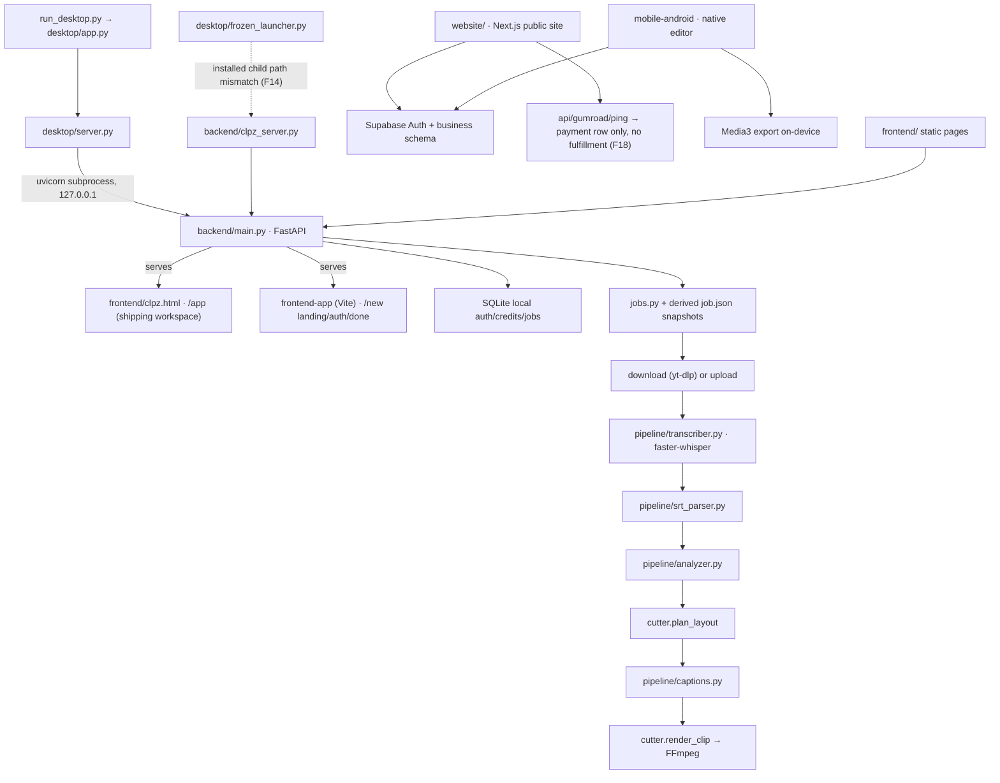

# CLPZ — Current architecture (corrected)

Status: reflects code verified on 2026-09-17 at baseline commit 76e4b0a.
Supersedes the earlier supplied diagram. Decisions are recorded in
[ADR-0001](ADR-0001-product-architecture.md); ownership rules are repeated
below. Open questions live in [docs/foundation/DECISIONS.md](foundation/DECISIONS.md).

## Current paths

Dotted link = intended but currently defective path. No website-to-desktop
identity handoff exists yet (task 16). Website/Android never touch the local
FastAPI backend.

## Route and data ownership

| Surface / data | Owner | Notes |
|---|---|---|
| `/app` workspace, `/new` React pages, `frontend/` static | served by `backend/main.py` | `/app` is the shipping desktop UI (ADR-0002) |
| `website/*` | Next.js app (separate deploy root) | public site; checkout gated (task 15) |
| Jobs, attempts, edit versions | local SQLite (task 10 declares authority) | `job.json` = derived snapshot |
| Original media, transcripts, outputs | local project store | never uploaded by default |
| Cloud identity, payments, entitlements | Supabase | desktop SQLite is dev/legacy |
| Android projects | on-device store | separate surface |

## Trust boundaries

1. **Desktop host boundary:** the FastAPI process binds `127.0.0.1`; the
   browser context is untrusted until task 03 adds Host/Origin validation and
   a per-launch capability token. Anonymous local jobs remain usable.
2. **Cloud boundary:** Supabase RLS + service-role functions; only the
   Next.js server holds the service key. Desktop SQLite credit edits can never
   mint cloud entitlements (ADR-0003).
3. **Media locality:** no component uploads user media to any cloud service.

## Dev vs installed paths

| | Development | Installed (frozen) |
|---|---|---|
| Entry | `run_desktop.py` → `desktop/app.py` | `CLPZ.exe` → `desktop/frozen_launcher.py` |
| Server | `desktop/server.py` spawns uvicorn from source | `backend/clpz_server.py` frozen as `clpz_server/clpz_server.exe` |
| Data dir | `desktop_data/` (project root) | `%APPDATA%\CLPZ` (and `%LOCALAPPDATA%\CLPZ\data` for backend defaults) |
| Debug | `CLPZ_DEBUG=1` default | forced production settings; inherited debug must be ignored (F14) |
| Frontends | served from source paths | bundled inside the assembly |

## Capability status (tasks 01 deliverable)

| Capability | Status |
|---|---|
| Import local video, generate clips, edit (trim/speed/mute/text), export | **Works in dev**; export has confirmed mute/0.25× defects (task 06) |
| Retry/resume after mid-pipeline failure | **Broken** (F05, task 05) |
| Local accounts, sessions, admin | **Works with security defects** (F01–F04, task 04) |
| Local credits/ledger | **Legacy; not atomic** (F08/F10, task 08) |
| Backups | **Broken on second run** (F11, task 10) |
| Installed launcher lifecycle | **Defective child path / watchdog ownership** (F14, task 12) |
| Installer build | **Incomplete automation** (F16, task 13) |
| Website auth (email/Google), account page | **Works** (build verified); recovery + redirect safety gaps (F21/F22, task 17) |
| Website payments | **Recording only, no fulfillment** (F18/F19, task 15) |
| Android import/save/export | **Preview** (unverified on devices, task 20) |
| Semantic moment analysis | **Heuristic ranking**; quality unmeasured (task 21) |
| Cloud schema | **Written, untested against real roles** (F17, task 14) |

Anything not listed here is untested.
