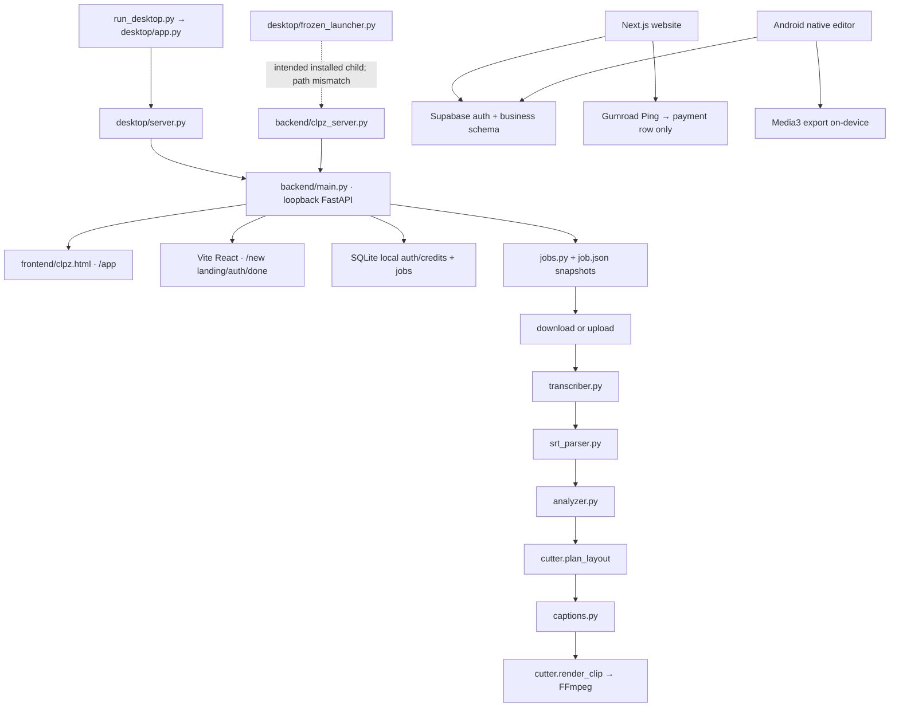

# Architecture and implementation foundation

Status: proposed foundation, not implemented changes. Existing code wins over an old diagram when describing current behavior.

## What the supplied diagram gets right

CLPZ separates distribution/site, Windows host, local FastAPI, jobs/data, interfaces and media processing. FFmpeg/subprocess management is a real shared boundary. Most named source files exist.

## Corrections needed

| Diagram impression | Current implementation |
|---|---|
| app.py → server.py describes all Windows starts | That is development. The installed build uses desktop/frozen_launcher.py and backend/clpz_server.py. |
| Analyzer precedes transcription | jobs._run_pipeline downloads/imports, transcribes, parses, selects candidate clips, plans layout, builds captions and renders. |
| SQLite is the sole job record | jobs are written to SQLite and job.json; startup recovery reads JSON snapshots. This needs one declared authority. |
| React is the desktop workspace | The launcher opens /app, served by frontend/clpz.html. App.tsx routes only landing/auth/done under /new. |
| Android belongs to the local backend flow | Android imports and exports on-device and uses Supabase auth. No implemented local-FastAPI connection was established. |
| Website checkout implies fulfillment | The Ping route records payments but does not associate an account or grant entitlements. |
| All identity is local | Website and Android already use Supabase; desktop still has independent SQLite accounts. |
| Every media subprocess crosses proc.py | Transcription probing/extraction and editor rendering contain direct subprocess calls. Cancellation coverage is incomplete. |

## Current paths

Dotted link = intended but currently defective path. No website-to-desktop identity handoff is implemented.

## Proposed ownership contract

| Data/capability | Authority | Local copy | Rule |
|---|---|---|---|
| Original videos, audio, transcripts and outputs | Local filesystem/project store | Yes | Do not introduce cloud media upload by accident. |
| Jobs, attempts, project/edit versions | Local transactional store | Derived snapshots allowed | One authority; committed state must survive restart. |
| Cloud user identity | Supabase Auth | Secure session cache | Do not equate a typed email with a verified identity. |
| Paid purchases, entitlements and credits | Cloud service/database | Minimal verified/cache data | Local SQLite edits cannot grant cloud access. |
| Anonymous local workflow | Explicit desktop runtime | Per-launch capability/workspace identity | No public hosted workspace implied. |
| Release version and artifact hash | Tested release manifest | Cached metadata | Download points to the exact tested artifact. |
| Android projects | On-device store | Yes | Android is a separate product surface, not feature parity by assumption. |

For a free local release, paid APIs can remain disabled. Commercial integration is conditional on explicit product policy; it must not delay unrelated export/recovery fixes.

## Interfaces to define before larger implementation

These are required contract shapes, not new routes that already exist:

1. **Job:** stable job ID, owner/local workspace, schema version, lifecycle state, attempt ID, completed-stage artifacts, progress and structured error. Define legal state transitions; a UI label is not durable state.
2. **Submission:** principal + operation + idempotency key + canonical request fingerprint. Matching replay returns original result; different content is a conflict.
3. **Artifacts:** original source, SRT, timed words, selected ranges, crop/caption plan, rendered clip, validation and edit-version provenance. Validate persisted artifacts before trusting a completed-stage marker.
4. **Edit version:** immutable original reference, version ID, trim in source seconds, speed, audio settings, overlay/caption/crop settings, schema version and export references.
5. **Worker:** bounded admission, cancellation handle, absolute deadline, resources, temporary outputs and a durable terminal result.
6. **Ledger:** operation ID, user, job/attempt or provider event, amount, type, original grant reference and replay payload. Balance mutation and replay recording are one transaction.
7. **Cloud credits:** separate expiring subscription grants from permanent purchased grants if current advertised terms remain. Define spend order and reversal allocation.
8. **Webhook inbox:** provider event/sale identity, validation, receipt time, effective event time/state, fulfillment status, retries and linked account. An HTTP 200 is not proof of fulfilled access.
9. **Entitlement:** verified user, feature/plan, validity/offline policy, revocation/version and a secure cache. The owner must define offline semantics.
10. **Release:** version, source commit, platform, tool/model versions, hashes, signature status and acceptance report.

Specify actual field names, units, error codes and migration versions in the owning task; do not rewrite every API at once.

## Owner decisions

| Decision | Proposed baseline for planning | Still required |
|---|---|---|
| First stable product | Windows local workspace | Owner confirms paid/free scope. |
| Desktop UI | Keep working vanilla /app initially | Any React migration is separate work. |
| Public site | Next.js website/ | Choose one deployment root configuration. |
| Cloud account authority | Existing Supabase integration | Verify staging project/providers/roles. |
| Local account database | Legacy/development until migration | Decide migrate/retire/retain explicit private use. |
| Paid model | Preserve displayed offers as unconfirmed terms | Exact charge unit, grants, expiration, refunds and retry rules. |
| Android | Separately labeled preview | Supported devices and release readiness target. |
| AI quality | Measured supported capability | Fixture rubric, languages, hardware and thresholds. |

## Working sequence

Define contracts → make checks reproducible → secure local/account boundaries → repair media/recovery/accounting → harden workers/persistence → repair/install package → verify cloud schema/payments/identity → finish journeys/editor/library/Android → measure quality → accept the release.

Avoid feature expansion until these boundaries and existing workflows are reliable.

